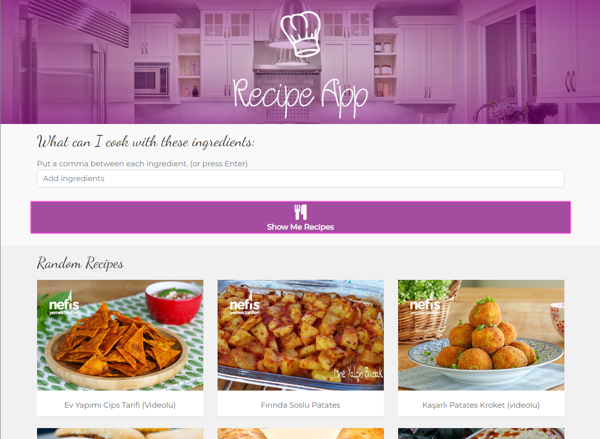
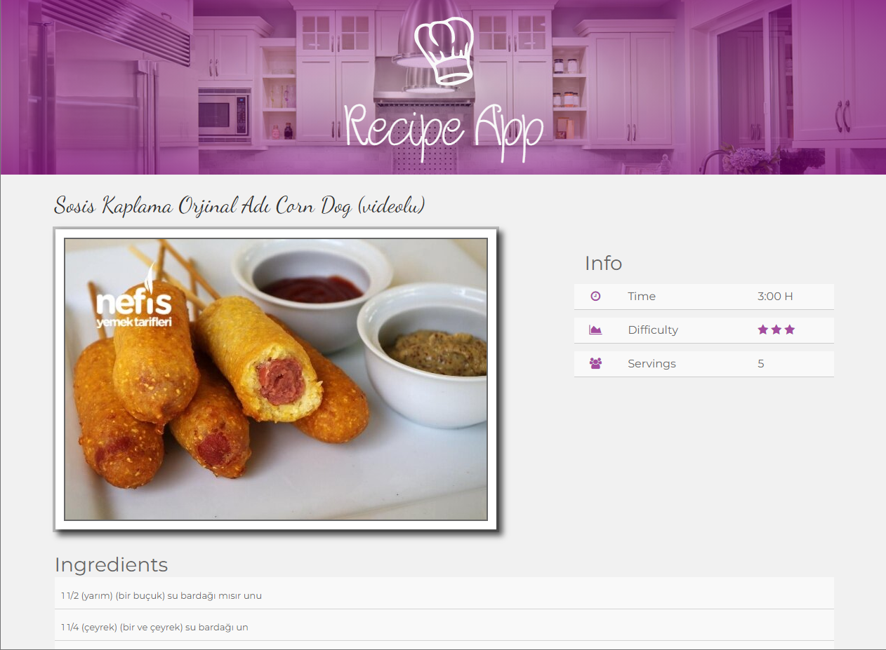
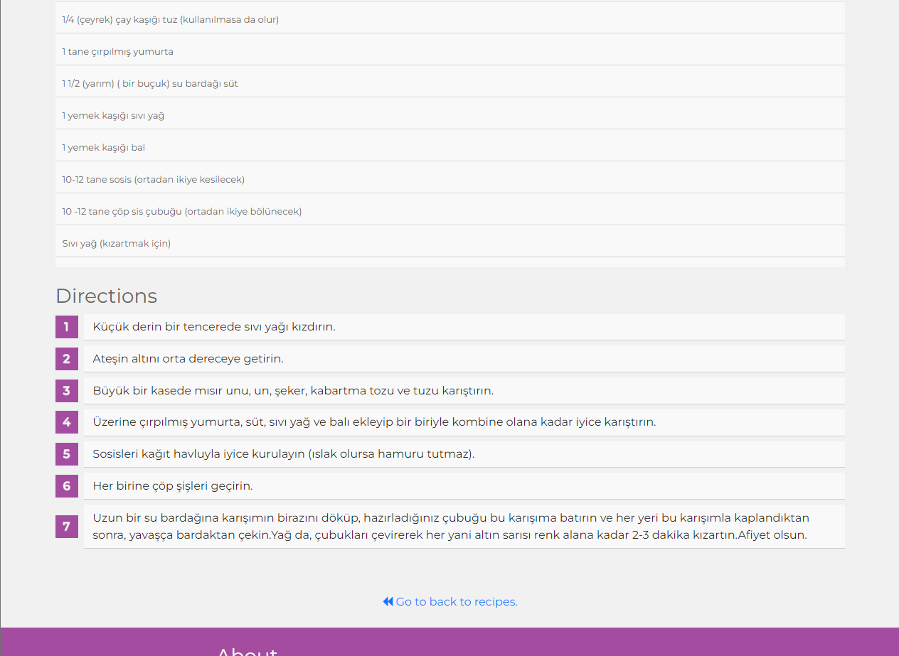

# Django Recipe App

A Django app for publishing recipes that end users can filter by the ingredients they have.

## Requirements

`pip install -r requirements.txt`

## How to run

 - ### Firstly, run:
`python manage.py migrate` in order to apply the database migrations.
 - ### Secondly, run:
`python manage.py runserver` to start the development server. You can access the app at http://localhost:8000/
 - ### To scrape a recipe from nefisyemektarifleri.com:
 Open another terminal and run:
`python manage.py shell`
`exec(open('recipes/bot.py').read())`
Then enter the recipe URL and the bot will scrape and add the recipe to the database.

## Disclaimer
No copyright infringement or no commercial use is intended/encouraged, and the recipes are taken from Nefisyemektarifleri.com. All rights for the recipes belong to their rightful owners.

## Screenshots

